# System Architecture Diagram

```mermaid
graph TD
    subgraph UI["UI Layer (src/components/)"]
        direction LR
        Sidebar["Sidebar\nConversationList"]
        ChatInterface["ChatInterface\nMessageList · InputBox\nAttachmentPreview · ToolCallBlock"]
        SettingsPanel["SettingsPanel\nApiParams · ModelSelector\nRoutingRulesEditor · McpSettings"]
        MemoryPanel["MemoryPanel"]
        Toast["Toast"]
    end

    subgraph App["App Root (src/app/App.tsx)"]
        AppRoot["App.tsx\nOrchestrates all hooks\nRoutes tool calls\nManages modal state"]
    end

    subgraph Hooks["Custom Hooks (src/hooks/)"]
        useChat["useChat\nMessage sending\nStreaming · Tool dispatch\nAttachment processing"]
        useSettings["useSettings"]
        useModels["useModels\nFetches model list"]
        useRouting["useRouting\nAuto model selection"]
        useMemory["useMemory\nMemory injection\nFact extraction\nMemory tools"]
        useTools["useTools\nMCP server lifecycle\nTool execution"]
        useStreaming["useStreaming\nAbortController\nChunk accumulation"]
    end

    subgraph Stores["Zustand Stores (src/app/store/)"]
        ChatStore["useChatStore\nconversations[]\ncurrentConversation\nstreamingState"]
        AppStore["useAppStore\nsettings · apiConfig\nloading · error"]
    end

    subgraph Services["Services (src/services/)"]
        subgraph OpenAI["OpenAI / LLM"]
            OpenAIClient["OpenAIClient\nstreamChatCompletion()\nfetchModels()"]
            streamChat["streamChat()\nSSE parsing\nTool call accumulation\nonChunk · onToolCalls · onComplete"]
        end
        subgraph MCP["MCP Protocol"]
            McpClient["McpClient\ninitialize()\nlistTools()\ncallTool()\nJSON-RPC 2.0"]
            McpStorage["mcpStorage\nloadServers()\nsaveServers()"]
        end
        subgraph MemSvc["Memory"]
            MemStorage["memoryStorage\nCRUD for MemoryEntry[]"]
            MemExtractor["memoryExtractor\nextractFacts()\nLLM-based dedup"]
        end
        subgraph Routing["Routing"]
            TaskRouter["taskRouter\nclassifyTask()\ninferCapabilities()\nselectModel()"]
            RoutingConfig["routingConfig\nloadRoutingConfig()\nsaveRoutingConfig()"]
        end
        subgraph Vision["Vision"]
            ImageProcessor["imageProcessor\nvalidateImage()\nresizeAndCompress()\ndetectVisionCapability()"]
        end
        subgraph Storage["Storage"]
            ConvStorage["ConversationStorage\nJSON → localStorage"]
            SettStorage["SettingsStorage\nJSON → localStorage"]
        end
        subgraph Export["Export"]
            ExportSvc["jsonExport\nmarkdownExport"]
        end
    end

    subgraph LocalStorage["localStorage (Browser)"]
        LS_Conv["ai-chatroom-conversations"]
        LS_Settings["ai-chatroom-settings / app-store"]
        LS_Memory["ai-chatroom-memories"]
        LS_Routing["ai-chatroom-routing-config"]
        LS_MCP["ai-chatroom-mcp-servers"]
    end

    subgraph External["External Services"]
        LLM_API["OpenAI-Compatible API\n(configurable URL + key)"]
        MCP_Servers["MCP Servers\n(user-provided HTTP endpoints)"]
    end

    %% App ↔ UI
    AppRoot --> Sidebar
    AppRoot --> ChatInterface
    AppRoot --> SettingsPanel
    AppRoot --> MemoryPanel
    AppRoot --> Toast

    %% App ↔ Hooks
    AppRoot --> useChat
    AppRoot --> useSettings
    AppRoot --> useModels
    AppRoot --> useRouting
    AppRoot --> useMemory
    AppRoot --> useTools

    %% Hooks ↔ Stores
    useChat --> ChatStore
    useChat --> AppStore
    useSettings --> AppStore
    useModels --> AppStore
    useStreaming --> ChatStore

    %% Hooks ↔ Services
    useChat --> streamChat
    useChat --> ImageProcessor
    useChat --> TaskRouter
    useChat --> MemStorage
    useChat --> MemExtractor
    useModels --> OpenAIClient
    useRouting --> TaskRouter
    useRouting --> RoutingConfig
    useMemory --> MemStorage
    useMemory --> MemExtractor
    useTools --> McpClient
    useTools --> McpStorage

    %% Services internal
    streamChat --> OpenAIClient
    TaskRouter --> RoutingConfig

    %% Services ↔ Storage
    ChatStore --> ConvStorage
    AppStore --> SettStorage
    ConvStorage --> LS_Conv
    SettStorage --> LS_Settings
    MemStorage --> LS_Memory
    RoutingConfig --> LS_Routing
    McpStorage --> LS_MCP

    %% External calls
    OpenAIClient -->|"REST / SSE"| LLM_API
    McpClient -->|"JSON-RPC 2.0 / SSE"| MCP_Servers
    MemExtractor -->|"LLM call for fact extraction"| LLM_API

    %% Data flow annotation
    subgraph Flow["Message Send Flow"]
        F1["1 User input + attachment"]
        F2["2 Resize/compress image"]
        F3["3 Resolve model (auto routing)"]
        F4["4 Build API messages + inject memories"]
        F5["5 Stream to LLM (SSE)"]
        F6["6 Execute tool calls (MCP / memory)"]
        F7["7 Extract & store new memory facts"]
        F1 --> F2 --> F3 --> F4 --> F5 --> F6 --> F7
    end

    classDef uiClass fill:#dbeafe,stroke:#3b82f6, color:#3b82f6
    classDef hookClass fill:#dcfce7,stroke:#16a34a, color:#16a34a
    classDef storeClass fill:#fef9c3,stroke:#ca8a04,color:#ca8a04
    classDef serviceClass fill:#fce7f3,stroke:#db2777,color:#db2777
    classDef storageClass fill:#f3e8ff,stroke:#9333ea,color:#9333ea
    classDef externalClass fill:#ffedd5,stroke:#ea580c,color:#ea580c

    class Sidebar,ChatInterface,SettingsPanel,MemoryPanel,Toast uiClass
    class useChat,useSettings,useModels,useRouting,useMemory,useTools,useStreaming hookClass
    class ChatStore,AppStore storeClass
    class OpenAIClient,streamChat,McpClient,McpStorage,MemStorage,MemExtractor,TaskRouter,RoutingConfig,ImageProcessor,ConvStorage,SettStorage,ExportSvc serviceClass
    class LS_Conv,LS_Settings,LS_Memory,LS_Routing,LS_MCP storageClass
    class LLM_API,MCP_Servers externalClass
```

## Layer Reference

| Layer                     | Color          | Role                                        |
| ------------------------- | -------------- | ------------------------------------------- |
| **UI** (blue)             | Components     | Render-only, no business logic              |
| **Hooks** (green)         | Orchestration  | Connect UI to stores & services             |
| **Stores** (yellow)       | State          | Zustand global state + persistence triggers |
| **Services** (pink)       | Business logic | API clients, storage CRUD, algorithms       |
| **localStorage** (purple) | Persistence    | Five namespaced keys, all JSON              |
| **External** (orange)     | I/O            | OpenAI-compatible LLM API + MCP servers     |

## Message Send Flow (7 steps)

1. User input + attachment arrives at `InputBox`
2. Image resized/compressed via `imageProcessor` (max 1920px, JPEG 80%)
3. Model resolved — if `"auto"`, `taskRouter` classifies task and picks model
4. API messages built with conversation history + injected memories (last 10 facts)
5. Streamed to LLM via SSE; chunks dispatched to `useChatStore`
6. On `finish_reason: "tool_calls"`, tools executed (MCP servers or memory tools)
7. After completion, `memoryExtractor` fires async LLM call to extract and store new facts
